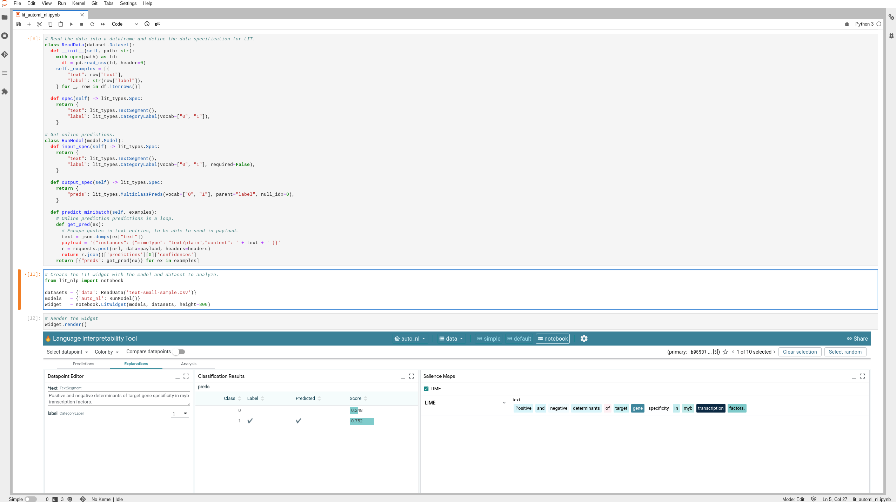

# ml-on-gcp-explainable-ai-xai
Healthcare use cases for Explainable AI on GCP using three different type of data sources. 

1. **Text**   : LIT ([Language Interpretability Tool](https://github.com/PAIR-code/lit)) on AutoML NL  
  
Emphasize of the keywords that have higher influence on the relationship for transcription factors and traget genes.
2. **Images** : Explainability in Vertex AI Vision  
3. **Tables** : Global and Local Explainability with BigQuery ML  

